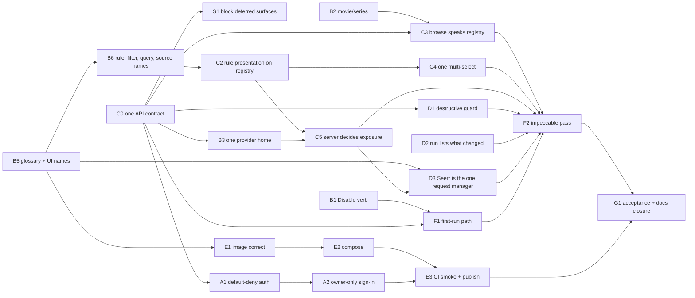

# Warden MVP path

**Status:** approved when this file merges to `main`. Execution is tracked in GitHub Issues (see
[Tracking and sign-off](#tracking-and-sign-off)). Each slice below is one PR, built test-first (`/tdd`
or the `plan-and-go:tdd-engineer` persona). The provider e2e implementation work (tracked in
[`provider-e2e-spec/specs/_implementation-map.md`](../provider-e2e-spec/specs/_implementation-map.md))
widens provider coverage and is sequenced after this MVP (see [Post-MVP](#post-mvp-parked-in-order)).

## Definition of done

The MVP is done when all three of these hold for the deployed container:

1. **Everything exposed works.** Every feature in [In scope](#in-scope) is reachable, works, and is
   verified in G1. Every offered provider type, rule and task is included.
2. **Nothing else is exposed.** Every path to a deferred feature is blocked: no nav item, reachable
   page, API route, provider type, rule or task leads to it. Deferred code stays in the codebase,
   compiled, typechecked and covered by its existing tests, ready to be un-deferred (decision 7).
3. **The system is simplified.** Simplified means low cognitive load. Each concept has **one name**
   and **one mechanism** across UI, API, code and docs, and no two of those contradict each other.
   `VOCABULARY.md`'s glossary is the single list of names, fed by this plan's [Glossary](#glossary)
   as slices ship. Names are not test-enforced: wording is checked in review, and renamed types are
   proved complete by typecheck.

Exposure is decided by **one mechanism**: a single **scope declaration** (`contract/scope.ts`,
created in S1) lists every deferred page, API procedure, provider type, rule and task. The server
refuses deferred procedures and leaves deferred types, rules and tasks out of its projections.
The client hides deferred nav items and page sections, and a deferred page URL answers 404. Nothing
else decides exposure, and un-deferring a feature is one line removed from that file.

## In scope

| Feature | What must work |
|---|---|
| **Sign-in** | Plex sign-in by the owner only (the first sign-in claims the instance), sign-out, and a session that survives a container restart. |
| **Providers** | Add, edit, test and delete a provider of an offered type. Radarr/Sonarr allow multiple instances. Enable tasks per instance. |
| **Media** | Browse movies and series from configured sources. Filter, filter by title, sort and paginate. |
| **Queries** | Save a filter set as a query, list, preview and delete. |
| **Automations** | Create from one or more include/exclude queries, a task (with its select parameter, if any) and a schedule. List, Run Now, Disable/Enable and Delete. A destructive task states its blast radius before saving. First-run guidance when setup is incomplete. |
| **Runs** | History of runs with status, count, error and the items each run targeted, including items since removed from their source. |
| **System** | System automations (identity resolution, enrichment) listed with Run Now, health status, and media data reset. |
| **Delivery** | `docker compose up` with a persistent volume, a health check, graceful stop, migrations on boot, and an image published by CI. |

The [Destination scenario](#destination-scenario) exercises the core path through these features.

## Out of scope (deferred and blocked)

These stay in the codebase untouched apart from glossary renames, which typecheck forces on all
code. Every path to them is blocked by the scope declaration.

| Surface | Why it's deferred |
|---|---|
| Dashboard page | Automations plus first-run guidance is the MVP landing page (decision 3). |
| Ratings page, media-page ratings panel, `/api/providers/ratings` | Ratings currently have two mechanisms (F10). Unifying them is `docs/intent/media-ratings-provider.md`'s work. |
| Search page, `/api/search/metadata` | A second way to find a title beside the title filter (F11). Its role is decided when un-deferred. |
| `/api/providers/metadata` | No MVP consumer. |
| `/api/app-settings` (the `appSettings` module, `settingsAwarePrecedence.ts`) | No UI and no consumer yet. It is the input to the post-MVP precedence work. |
| Provider type TVMAZE | Not buildable through `ProviderFactory` yet (its API key is lost), so offering it is a reachable broken path (L1). |
| Provider type OMDB | It feeds only the deferred ratings path. |
| Provider type TMDB | Not in the verification stack (decision 9). Login-page backdrops keep using the `TMDB_API_KEY` environment setting, which is separate from the provider type. |
| Rules with no control or no live producer | For example, `certification` has no lookup today. C5's invariant lists them in the declaration. |

Which provider types and tasks are offered is decided by decisions 9 and 10: **offered means
verified in G1**, and everything else of those kinds is declared deferred.

## Glossary

One name per concept, everywhere. Settled names live in
[`VOCABULARY.md`](../../architecture/VOCABULARY.md#glossary--one-name-per-concept). The rows below are
decided but not yet built; each slice moves its row into `VOCABULARY.md` when it ships.

| Concept | Canonical name | Retired names | Rationale | Slice |
|---|---|---|---|---|
| The engine's definition of something that can be filtered on: key, type, predicate, the field it reads, the providers producing that field, and their precedence when several do | **Rule** *(8a)* | `filterRegistry`, `filterFields`, `/api/filter-fields` | `MediaRule`/`MEDIA_RULES` keep their names. Engine-only: the client receives a `MediaRuleDescriptor` that carries presentation and never the predicate, field mapping, producers or precedence (C2). | B6 |
| A key/value pair: a rule's key and a chosen value, as set in the UI and stored by a query | **Filter** *(8a)* | `FilterValueEntry` | Knows nothing about which provider supplies the data; the rule resolves that. `FilterValue` stays the name of the value itself. | B6 |
| A query used by an automation, with role include/exclude | **Included / excluded query** *(8c)* | query source, `MediaQuerySource`, `automation_query_sources` | "Source" is reserved for one meaning (next row). | B6 |
| A provider that owns media | **Source** *(8d)* | `sourceProviders` on rules (becomes `providers`) | Today "source" means four things. It keeps one. | B6 |
| The request-manager provider | **Seerr** *(decided)* | Overseerr, `OVERSEERR`, `OverseerrProvider`, `overseerr*` rule keys | Decision 9a. Seerr is Overseerr's API-compatible successor, so one type serves both servers. | D3 |

## Destination scenario

> A self-hoster runs `docker compose up` and signs in with Plex. The first account becomes the owner,
> and every other account is refused. They add Radarr, Sonarr, and Plex or Tautulli, then build the
> query *"tagged `list-import`, added more than 90 days ago, unwatched"* and save it. They attach
> **Unmonitor movie** on a daily schedule and press **Run Now**. Runs then shows *which titles*
> changed. The container restarts with the schedule, history and session intact.

Every rule and task in it already exists (`tagIds`, `addedDaysAgo`, `watched`, `unmonitorMovie`).

## Design constraints

### Primary: simplify (low cognitive load)

A reader should never meet two names for one thing, two mechanisms for one job, or a doc that
contradicts the code. Every slice is judged against these lenses:

- **One name.** A slice that introduces or keeps a second name for a glossary concept is rejected.
- **One mechanism.** Prefer extending the existing authority. A slice that adds a map, enum, fetcher,
  endpoint or control beside an existing one is rejected. The fracture ledger's rule applies: *a
  translator is a fracture, persisted.* Heal by deleting the second vocabulary, never by bridging it.
- **Deletion.** Each slice names what it **deletes**. A heal that only adds code hasn't healed
  anything.
- **Altitude.** Fix the mechanism, not each call site. Examples: one default-deny auth mount instead
  of about 40 per-handler guards, and one registry field instead of a client lookup table.

### UI: impeccable (product register)

[`PRODUCT.md`](../../../PRODUCT.md) and [`DESIGN.md`](../../../DESIGN.md) are binding. Their
principles become these acceptance checks on every UI slice:

- **State clarity over polish.** Every surface has explicit loading, empty, error and success
  states. A destructive action states its blast radius (*"Deletes files for 214 movies"*) before it
  can be committed.
- **Density over decoration.** Tables and lists, not card grids or metric tiles.
- **Dark-first, WCAG 2.1 AA.** Body text 4.5:1, interactive elements 3:1, visible focus rings, and a
  reduced-motion alternative for every transition.
- **Banned:** side-stripe accent borders, gradient text, decorative glass, identical card grids,
  and an eyebrow above every section. Numbered steps only where the order is real (F1's first-run
  checklist).
- **Process:** story first. Each component change starts in its `.stories.tsx` under `yarn ladle`
  with `playwright-cli`, then gets verified in context under `yarn dev` (root `CLAUDE.md`). Stories
  use glossary names.

## Baseline (verified 2026-10-03, `main` @ `2fc775a`)

- `yarn typecheck` ✅, `yarn depcruise:ci` ✅, `yarn test:run` ✅ (166 files, 1,420 tests).
- The container image has **never been built in CI**, and Docker is not installed on the dev box.
  E1 makes the image verifiable.

## Findings this plan heals

### Blockers to exposing the container

| # | Finding | Evidence |
|---|---|---|
| X1 | **Any Plex account can sign in.** The first sign-in creates a user with no owner or allowlist check. Combined with X2, a stranger could configure providers and run delete tasks. | `server/modules/auth/authService.ts` `authenticateWithPlex` |
| X2 | **Auth is opt-in per handler, and coverage has gaps.** `/api/providers/*` (tasks, task-options, metadata, ratings) and `/api/filter-fields` have no guard. One route carries the comment *"dev/config-time endpoint — add auth when the feature moves beyond the playground stage."* | `providers.routes.ts`, `providers.handler.ts` (0 guards), `media.filterFields.*` (0 guards). **Healed by A1:** the contract implementer's root guard refuses every procedure except four public ones (health, Plex sign-in, sign-out, backdrops), pinned by `defaultDenyAuth.integration.test.ts`. |

### Two names or two mechanisms for one concept

| # | Fracture | Evidence |
|---|---|---|
| F1 | **Automation verb model, stated three ways.** `VOCABULARY.md` says *Run Now / Disable / Archive, never Play/Pause*. The code says status `'paused'` with Pause/Play icons. `system-vs-user-automations.md` says *Pause/Resume/Delete*. | `automationService.ts:50`, `AutomationRow/index.tsx:6,165`, `automations.schemas.ts:72`, `useAutomations.ts:51,82` |
| F2 | **Movie/series has three spellings.** `ContentType` vs `MediaKind` (16 sites), the value `'show'` vs `/api/media/series`, `seriesSort`, `SERIES_PARAM_TO_KEY`, and UI copy "No series match". | `providers/roles.ts:101`, `filterRegistry.ts:11`, `media.routes.ts:33` |
| F3 | **Three HTTP homes for providers and settings.** Provider CRUD lives at `/api/settings/providers` in a "transport-only" module, tasks at `/api/providers`, and system settings in an `appSettings` module **missing from `.dependency-cruiser.cjs`, so its boundaries are unenforced**. | `server/modules/index.ts`, `.dependency-cruiser.cjs:14` |
| F4 | **Docs contradict code.** Core model: *"one active provider per type"* vs multi-instance sources, *"roles declared by the interfaces it `implements`"* vs adapter-bound roles, and an `addedBy=list` rule that doesn't exist. `precedence.ts` says `primaryMediaServer` "isn't built yet" while an unused `applyPrimaryMediaServer` exists. The implementation map says AutomationBuilder has no single-select parameter UI, but it does. The ledger cites the wrong path for `mediaQueryAdapters.ts`. Two intent docs link to missing files. The Dockerfile says `warden.db` vs config `maintainarr.db`. The README says port 5056 vs 5057. `INVENTORY.md` describes deleted files. | as cited |
| F5 | **Rule vs filter used interchangeably.** `MediaRule`/`MEDIA_RULES`/`useMediaRules` beside `filterRegistry.ts`, `/api/filter-fields`, `FilterValue`, `MediaFilterBar` and the UI's "Add filter". | `filterRegistry.ts`, `useMediaRules.ts` |
| F6 | **"Saved queries"** in the live UI, a name `VOCABULARY.md` retired. | `pages/automations/index.page.tsx` |
| F7 | **"Source" means four things:** the `MediaSource` role, an automation's include/exclude `MediaQuerySource`, `MediaQuerySpec.sources`, and a rule's `sourceProviders`. | `mediaQueryEngine.ts:27`, `filterRegistry.ts` |
| F8 | **System automations are called "Tasks"** on the System page, while "Task" means a provider action everywhere else. Stories add "New Task" and "Active Tasks" for automations, plus "Collections". | `pages/system`, `*.stories.tsx` |
| F9 | **The client re-declares the provider catalogue.** `PROVIDER_REGISTRY` lists 8 of the 10 types with hand-written labels and `filterCapabilities` strings, while the server's enum, factory and roles are the real authority. | `src/lib/provider-registry.ts` |
| F10 | **Ratings have two mechanisms**: rating filters via enrichment, and an ad-hoc `/api/providers/ratings` aggregation feeding a separate page and panel. | `ratingsAggregation.ts`, `pages/ratings` |
| F11 | **Title lookup has two mechanisms**: the title filter, and the Search page's cross-provider metadata search. | `pages/search`, `media.search.*` |
| F13 | **The rule descriptor leaks engine concerns to the client.** It is `Omit<MediaRule, 'predicate'>`, so `sourceField` and `sourceProviders` cross the wire, and the client's `groupsFor` derives section headings from providers. The client also re-declares `MediaRuleDescriptor` itself. The rule/filter split is load-bearing: precedence and production are engine concerns. | `filterRegistry.ts:57`, `MediaFilterBar/index.tsx:830`, `src/hooks/useMediaRules.ts:7` |
| F12 | **The client/server bridge is partial, so either side can grow alone.** 48 `defineRoute` routes, but only 21 declare a response schema and 5 server files share the client's schemas. The client hand-writes 43 `/api/...` URL strings, and 1 hook validates a response. MSW mocks are a third hand-kept copy. The dependency runs backwards (`server/` imports `src/lib/api/schemas.ts`), and the client imports server internals (`@server/modules/media/browseRangeKeys`). Nothing fails when a route is added on one side only. | `server/kernel/defineRoute.ts`, `src/lib/api/schemas.ts`, `src/hooks/*`, `tests/mocks/handlers/*`, `src/lib/mediaQueryAdapters.ts:31` |

### Duplication (one job, many copies)

| # | Duplication | Evidence |
|---|---|---|
| D1 | **13 hand-rolled SWR fetchers.** Each has its own error string, an unchecked `json.data as T` cast, and inconsistent envelopes (`/api/filter-fields` returns a bare array). Server error messages are swallowed. | `src/hooks/use*.ts` |
| D2 | **The client re-declares rule presentation:** `BOOLEAN_VALUE_LABELS`, `SEGMENT_LABEL_OVERRIDES`, `ENUM_OPTIONS`, and key-switched `csvIdOptions`/`csvStringOptions`. | `MediaFilterBar/index.tsx:855-1000` |
| D3 | **Browse and save encode filter state two ways.** `MOVIE_PARAM_TO_KEY`/`SERIES_PARAM_TO_KEY` + `toFilterValues()`, a range satellite map and its coverage check, and the client mirror `toBrowseParams()`. | `media.handler.ts:169-345`, `src/lib/mediaQueryAdapters.ts:194` |
| D4 | **Three multi-select controls** in one 1,829-line file. | `MediaFilterBar/index.tsx:136,342`, `filters/OptionFilter` |
| D5 | **`'active' \| 'paused'` declared in four places**, and `z.enum(['movie','show'])` re-declared beside `ContentTypeSchema`. | F1 sites, `mediaQueries.schemas.ts:15` |
| D6 | **Migrations copied into the image twice**, and `nodemon` ships in production dependencies. | `package.json` `build:server`, `Dockerfile` |

### Loose ends (reachable but broken, or unreachable but present)

| # | Loose end | Evidence |
|---|---|---|
| L1 | Creating a SEERR or TVMAZE provider passes validation, then throws in `ProviderFactory`. | `settings.schemas.ts:4` (`nativeEnum`), `providerFactory.ts:72` |
| L2 | `/api/providers/metadata` and `/api/app-settings` have no consumer. | route grep |
| L3 | Rules in the API that the UI can never render, such as `certification`. | `ruleRendersControl` |

## Slice protocol

TDD here means **`plan-and-go:tdd`**, executed by the **`plan-and-go:tdd-engineer`** agent. This plan
does not define its own TDD process. Each slice supplies the *input* to that skill, not the cycles.

**Running a slice:**

1. **Spawn the builder:** `Agent(subagent_type: "plan-and-go:tdd-engineer", model: <slice's Model
   line>)`, pointed at this file's slice section and its GitHub issue. The agent definition supplies
   phase discipline, the mismatch protocol and working-tree discipline.
2. **The agent reads the skill directly with the Read tool:**
   `~/.claude/skills/plan-and-go/skills/tdd/SKILL.md` and its `references/` (`phases.md`,
   `extracting-steps.md`, `red-phase.md`, `refactor-phase.md`). It must not invoke
   `Skill(plan-and-go:tdd)`, because the skill's header says it is executed by the tdd-engineer
   agent, which would trigger a nested spawn from inside that agent.
3. **Extract steps first.** The agent turns the slice's **Behaviours** into cycle steps per
   `extracting-steps.md`: tracer bullet, then domain behaviours, boundaries, rejections, recovery.
   Pre-flight work (installs, config) is separated out. It posts the step list to the slice's issue
   before the first RED.
4. **Cycles follow the skill exactly:** one behaviour, one test, one cycle (the Atomic Cycle Rule).
   RED is confirmed by an assertion failure, not a compile error. GREEN is naive. REFACTOR is
   mandatory before the next test.
5. **Plan state vs code.** Each slice's Findings and Behaviours describe the tree as of `2fc775a`. If
   the agent finds the code differs, it stops and uses the agent's **mismatch protocol**. It does not
   adapt the plan on its own.

**What each slice provides as skill input:**

- **Behaviours.** Observable behaviours the steps are extracted from, in domain language. These are
  not pre-written tests and not a batch.
- **Expected end state.** The structure the plan expects once the cycles are done. RED is the
  interface-design instrument, so where cycles reveal a better shape, the slice PR updates this file
  to match what was built.
- **Deletes.** Duplicates the slice replaces with the one canonical mechanism, such as a second
  fetcher, a translator or a client-side copy of a server catalogue. These are REFACTOR-phase DRY
  targets, and the slice isn't done while any remain. A *Deletes* line never names a feature;
  features out of MVP scope are deferred and blocked by S1, never removed.
- **Model.** The model override for the builder agent.

**Slices that are not TDD:** B4 (docs, governed by `docs-lifecycle`), F2 (design pass, governed by
`impeccable`; any behaviour change it needs becomes a TDD step) and G1 (acceptance, governed by
`playwright-cli`).

**Around the cycles:**

- **Gate:** `yarn verify:fast` and `yarn depcruise:ci` green. UI slices start with a story under
  `yarn ladle` with `playwright-cli`, then get verified under `yarn dev` (root `CLAUDE.md`).
- **Commits:** one commit per green cycle, staging files by name (`git add .`/`-A` are not allowed,
  per the agent's working-tree discipline).
- **Durable writing (root `CLAUDE.md`):** every commit message, code comment and PR description
  states information that stays true and useful: the behaviour that now exists, the design decision
  the cycle settled and why. It never records the journey (attempts, mistakes fixed along the way,
  session context), and comments never narrate the task. A cycle's commit message is the durable
  part of its record. The PR description summarises the slice's end state (What / Why / Changes /
  Testing).
- **Design debt:** each row of the skill's **Design Debt** table becomes a GitHub issue labelled
  `design-debt`, linked from the slice's PR.
- **Docs:** `docs-lifecycle` triggers for every moved, renamed or behaviour-changed file. Each heal
  gets a fracture-ledger entry, Open when the slice starts and Healed when it merges. Finish with
  `graphify update .`.
- **Review:** `/code-review` on Opus for every PR, whichever model built it.

## Tracking and sign-off

- **Design:** this file. Changes to a slice's scope are edits here, made in the slice's own PR.
- **Execution:** GitHub Issues on `nokternol/warden`, in an `MVP` milestone. There is one issue per
  slice plus G1's acceptance issue, labelled by track (`track:S`, `track:A`…`track:G`), by model
  (`model:sonnet`/`model:opus`), and `blocked` until prerequisites merge. A parent tracking issue
  lists every slice as a sub-issue, with the dependency diagram below.
- **Progress:** each PR says `Closes #n`, so merging closes the slice. The milestone's completion
  percentage is the progress bar.
- **Plan sign-off:** merging the PR that adds this file. Issues are created from the merged version.
- **Slice sign-off:** reviewing and merging its PR. The issue's checklist must be met: the step
  list posted to the issue, one commit per green cycle, deletes done, gates green, docs updated,
  design debt filed, and screenshots for UI slices.
- **MVP sign-off:** ticking G1's checklist (every In-scope feature, offered provider type and offered
  task, verified on the published image on the NAS), then closing the milestone. `docs-lifecycle`
  then folds this plan's lasting content into `docs/architecture/` and deletes it.

## Slices

C0 goes first because S1, A1 and C5 all enforce through the contract. After it, tracks
A, B, D2 and E can run in parallel. Track B's renames land before the C slices that touch the same
names, so nothing is renamed twice.

### Track S — Scope

**S1 · Block deferred surfaces** *(decision 7; after C0)*
- **Model:** Opus 5.5 (the single exposure mechanism every surface consults).
- **Why:** [Out of scope](#out-of-scope-deferred-and-blocked), L1, L2.
- **Behaviours:**
  - A deferred API procedure answers 404, and its handler is never invoked.
  - A deferred page URL answers 404, and the navigation offers exactly the In-scope pages: Media,
    Automations, Runs, Providers, System.
  - A deferred section inside an in-scope page (the media-page ratings panel) does not render.
  - Every entry in the scope declaration names something that exists, so a stale entry fails the
    build.
  - Un-deferring is removing one entry: the surface is then reachable with no other change.
- **Expected end state:** `contract/scope.ts`, the single declaration, read by the contract
  implementer (refuses deferred procedures), by C5's projections (provider types, rules, tasks),
  and by the client's nav, page guard and section guard. Deferred code and its tests stay as they
  are.
- **Docs:** `docs/architecture/` gains the scope mechanism; architecture docs describing deferred
  surfaces note that they're deferred.

### Track A — Safe to expose

**A1 · Default-deny API auth** (after C0)
- **Model:** Opus 5.5 (security boundary; contract-driven coverage test).
- **Why:** X2. One guard at the root, with an explicit public allowlist, not per-handler opt-in.
- **Behaviours:**
  - An unauthenticated call to any contract procedure is refused with 401.
  - The public allowlist (health, Plex sign-in, sign-out, login-page backdrops) still answers
    unauthenticated.
  - A procedure added later is refused unauthenticated without anyone listing it.
- **Expected end state:** one auth middleware at the contract implementer's root (C0), with the allowlist
  declared on the contract.
- **Deletes:** the `public` marks on contract procedures that must not answer anonymously (C0 kept
  the previously unguarded routes public: provider tasks/task-options/metadata/ratings and the rules).
  The per-route `isAuthenticated()` calls and the "playground stage" comment went with C0's transport.
- **Note:** `BYPASS_AUTH=true` (development only, refused in production by config validation) lets
  every procedure answer without a user, for browser tooling. A1's coverage test keeps it in mind:
  the default-deny behaviours hold with the bypass off.

**A2 · Owner-only sign-in** *(decision 1)*
- **Model:** Opus 5.5 (security; ownership semantics).
- **Why:** X1.
- **Behaviours:**
  - The first Plex sign-in on a fresh instance becomes the owner.
  - A different Plex account is refused, and no user is created for it.
  - The owner signing in again succeeds and refreshes their stored token.
  - The login page tells a refused account why it was refused.
- **Expected end state:** an owner check in `authenticateWithPlex`.
- **Verify:** the login page shows a clear refusal state for a non-owner. Story first.

### Track B — One name per concept

**B1 · Automations are Disabled, not Paused** *(decision 2)*
- **Model:** Sonnet 5.5 (mechanical schema + migration + rename).
- **Why:** F1, D5.
- **Behaviours:**
  - An automation's status is `active` or `disabled`, and nothing else is accepted.
  - An active automation's row offers *Disable*, and a disabled one offers *Enable*. No Play or
    Pause control appears.
  - An automation stored as `paused` reads back as `disabled` after migration.
- **Expected end state:** one shared schema consumed by `automations.schemas.ts`, `automationService.ts` and
  `useAutomations.ts`, plus the migration.
- **Deletes:** the four literal unions and the `Pause`/`Play` imports.
- **Docs:** `VOCABULARY.md`'s verb row becomes *Run Now / Disable / Enable / Delete* (Archive stays
  in `docs/intent/automation-archive.md`). Correct `system-vs-user-automations.md`.

**B2 · One name for movie/series** *(decision 8e)*
- **Model:** Sonnet 5.5 (type + value rename with a data migration, guarded by typecheck).
- **Why:** F2, D5.
- **Behaviours:**
  - A content type is `movie` or `series`. `show` is rejected.
  - A query or identity stored as `show` reads back as `series` after migration.
- **Expected end state:** `ContentType` is the only TypeScript name, declared once as `ContentTypeSchema` in
  `contract/schemas.ts` (the contract owns wire types since C0) and imported by media, providers and the
  client. `NormalizedShow`/`show.ts` become `NormalizedSeries`/`series.ts`.
  `SOURCE_OWNER_BY_KIND` becomes `SOURCE_OWNER`. Migration 0026 rewrites stored `show` queries and
  identities to `series`.
- **Deletes:** `MediaKind`, the `ContentType` alias in `filterRegistry.ts`, the client's duplicate
  `ContentType` declaration and the inline `'movie' | 'show'` unions.

**B3 · One home for providers** (after C0)
- **Model:** Opus 5.5 (module move + dependency-direction rules).
- **Why:** F3.
- **Behaviours:**
  - Providers are created, read, updated, tested and deleted under `/api/providers`.
  - `/api/settings/providers` answers 404.
  - A module directory under `server/modules/` that the dependency rules don't cover fails the
    boundary check.
- **Expected end state:** move the CRUD handlers into `modules/providers/`.
- **Expected end state (boundaries):** `appSettings` joins `MODULES`/`ALLOWED_TARGETS` with its
  existing behaviour unchanged. Its route stays deferred by S1.
- **Deletes:** the transport-only `settings` module and the `/api/settings/providers` paths, whose
  handlers now live in `providers`.

**B4 · Docs agree with code** (doc-only, via `docs-lifecycle`)
- **Model:** Sonnet 5.5 (doc corrections from a fixed list).
- Fix every F4 item. Rewrite the core model's example as the Destination scenario. `INVENTORY.md`
  stays, with a header marking it a dated snapshot rather than current fact. Record F1–F11
  and D2–D3 in the fracture ledger as Open entries pointing at their slices.

**B5 · Glossary and user-facing names** *(decisions 6, 8)*
- **Model:** Sonnet 5.5 (renames; TDD covers only the runtime paths).
- **Why:** F6, F8, and the `maintainarr` residue: log filenames, the Plex OAuth product/device name,
  default `DB_PATH`, the Cypress home test, fixtures, `.env.example`, `config/README.md` and README
  links.
- **Behaviours:**
  - With no `DB_PATH` set, the database is `./config/db/warden.db`.
  - Logs are written as `warden-*.log`, and Plex lists the app as Warden.
- **Expected end state:** move the [Glossary](#glossary)'s built rows into `VOCABULARY.md` as
  documentation (no automated check reads it); the rows whose renames belong to later slices stay
  in the plan until those slices ship. Rename UI copy and stories as plain edits, verified in Ladle and
  `yarn dev`: Query not "Saved query", System automations not "Tasks", the Runs page at `/runs` not
  Activity, no Collections/services.
- **Note:** the new Plex product name makes the instance show up as a new device on plex.tv.
  Existing sessions keep working.

**B6 · Rule, filter, query and source names in code and API** *(decisions 8a, 8c, 8d)*
- **Model:** Sonnet 5.5 (cross-cutting rename; typecheck proves completeness).
- **Why:** F5, F7.
- **Behaviours:**
  - The retired code names (`filterRegistry`, `filterFields`, `FilterValueEntry`,
    `MediaQuerySource`, `querySources`, `sourceProviders`) are gone, and typecheck passes. They are
    listed in `VOCABULARY.md`'s deprecated table.
  - An automation's included and excluded queries survive the table rename intact.
  - A filter is exactly a rule key and a value. An instance-scoped value (tags, quality and language
    profiles) names the configured instance its ids belong to inside the value itself.
  - Stored instance-scoped filters read back with the same meaning after migration.
- **Expected end state:** rules live in `ruleRegistry.ts` (`MEDIA_RULES`, `MediaRule`,
  `MediaRuleDescriptor` unchanged) and are served by the contract's `rules` procedure. A filter is
  `Filter { ruleKey, value }`, and an instance-scoped value is `{ providerId, ids }` (`providerId`
  being the codebase's existing name for a configured instance). The migration folds
  `media_query_filter_values.providerId` into the value. An automation has included and excluded queries
  (`AutomationQuery { queryId, role }`, table `automation_queries`). A rule lists its `providers`.

### Track C — One mechanism per job

**C0 · One API contract** *(decision 11; first slice; before S1, A1, B3, C3, D1, F1)*
- **Model:** Opus 5.5 (the contract every client and server change builds on).
- **Why:** F12. The goal is that adding an API feature to one side only is impossible: one contract
  declares method, path, input, output and errors, and both sides are derived from it.
- **Mechanism (oRPC, contract-first):**
  - `contract/`: a top-level folder that depends only on `zod`. `oc.route({ method, path })
    .input(…).output(…)` for every In-scope route, served as REST via oRPC's OpenAPI handler, so
    URLs stay `/api/...`.
  - **Server:** `implement(contract)`. A contract procedure without a handler is a compile error,
    and so is a handler returning the wrong shape. Default-deny auth is one middleware at the
    implementer root (A1).
  - **Client:** a client typed from the contract, wrapped in one generic SWR hook. A call to a
    procedure that doesn't exist, or with the wrong input, is a compile error. No hand-written URLs.
  - **Mocks:** MSW handlers are typed against contract outputs, so mock drift is a compile error.
  - **Direction:** depcruise rules allow `src/ → contract/` and `server/ → contract/` only, with no
    `src/ → server/` and no `server/ → src/`.
- **Behaviours:**
  - A contract procedure that nothing in `src/` calls fails the build unless it's on the explicit
    allowlist of uncalled procedures, each with its reason: `system.health` (server-only) and the
    deferred `appSettings.get`/`appSettings.update`/`providers.metadata`, which have no client
    consumer yet (L2; S1 blocks them). This catches server-only features, which the type system
    can't.
  - An import from `src/` into `server/`, or from `server/` into `src/`, fails the boundary check.
  - Every ported procedure answers the same requests with the same results as the Express route it
    replaces.
- **Gate (not a TDD behaviour):** `yarn typecheck` runs a compile-fail fixture
  (`@ts-expect-error`) proving that a missing handler and an unknown client call both fail to
  compile. RED needs an assertion failure, so this is checked by typecheck rather than a cycle.
- **Deferred routes are ported too:** they become contract procedures like everything else, so S1
  can block them and nothing stays on the retired `defineRoute` mechanism.
- **Expected end state (as built):** `contract/` holds one namespace per domain (`appSettings`, `auth`,
  `automations`, `media`, `mediaQueries`, `providers`, `system`) at the unchanged `/api/...` paths, with the
  `{status:'ok', data}` / `{status:'error', error}` envelopes kept on the wire, so every existing
  integration test answers identically once re-mounted. `server/kernel/api.ts` holds the implementer
  (`api`, root default-deny middleware reading `meta.public`) and `serveApi`; each module has one
  `<module>.procedures.ts`, and `createApiRouter` assembles them with `api.router()`. The public set
  mirrors the previously unguarded routes (health, sign-in, sign-out, backdrops, rules, provider
  tasks/task-options/metadata/ratings), which A1 narrows. `src/lib/api/client.ts` (`api`,
  `createApiClient`) validates responses against the contract and surfaces the server's error;
  `useApi` is the one SWR hook. `tests/mocks/contract.ts` (`mockProcedure`) declares mocks. Provider
  CRUD/test are declared under `providers` but stay at `/api/settings/providers` and in the `settings`
  module; B3 moves the URL and the handlers. Browse is a contract procedure taking the legacy
  content-prefixed params unchanged; C3 changes the encoding.
- **Deletes:** `defineRoute`, every `*.routes.ts`/`*.handler.ts` transport pair (logic moves into
  procedures), `src/lib/api/schemas.ts` (moved into `contract/`), and the client's hand-written URLs.
- **Absorbs:** C1 (the contract client and `useApi` replace the 13 local fetchers and `json.data as T`
  casts, a failed call surfaces the server's message and status, a response that doesn't match its
  schema is an error, and `/api/filter-fields` is on the `{data}` envelope), A1's mechanism (A1 keeps its auth-coverage behaviour and
  the owner semantics in A2), B3's contract grouping (provider procedures, CRUD included, are declared
  under `providers` in the contract; B3 still moves their URL and implementation), and C3's transport
  (browse is a contract procedure; C3 still changes its input to the save encoding).

**C2 · Rule presentation lives on the registry** (after B6)
- **Model:** Opus 5.5 (registry contract every future provider builds on).
- **Why:** D2, F13.
- **Behaviours:**
  - A boolean rule carries its own value labels (for example *Monitored* / *Unmonitored*).
  - An enum-shaped rule carries its own options.
  - A multi-value rule names the lookup its options come from.
  - The filter bar renders a rule it has never seen, correctly, from its descriptor alone.
  - A rule's section heading comes from the descriptor, not from the client reading providers.
  - The descriptor exposes no engine concern: no predicate, field mapping, producer list or
    precedence.
- **Expected end state:** `MediaRule` gains `valueLabels?`, `options?`, `shortLabel?`, `lookup?` and
  `group`. The descriptor is an explicit allowlist of presentation fields (key, label, content
  types, data type, instance scoping, and those five), built by `toDescriptor`, not `Omit`.
- **Deletes:** `BOOLEAN_VALUE_LABELS`, `SEGMENT_LABEL_OVERRIDES`, `ENUM_OPTIONS`, `groupsFor`, the key
  switches in `csvIdOptions`/`csvStringOptions`, the client's own `MediaRuleDescriptor` declaration, and `ruleRendersControl` (C5 makes renderability a server
  fact).

**C3 · Browse speaks the registry** (after B2, C0)
- **Model:** Opus 5.5 (deletes a translator without changing results).
- **Why:** D3.
- **Behaviours:**
  - Browsing with a set of filter values returns exactly the items that previewing a query saved
    with the same values returns.
  - Browse requests use the same filter encoding as save.
- **Expected end state:** browse becomes `GET /api/media/:contentType` (`movie|series`) taking the same entries as
  save.
- **Deletes:** `MOVIE_PARAM_TO_KEY`, `SERIES_PARAM_TO_KEY`, `toFilterValues()`, the range satellite
  map and its coverage check, `toBrowseParams()`, and `/api/media/movies|series`.
- **Docs:** retire `docs/architecture/browse-range-param-enforcement.md`, since what it enforces is
  gone.

**C4 · One multi-select** (after C2; story first)
- **Model:** Sonnet 5.5 (component consolidation behind characterization tests).
- **Why:** D4.
- **Behaviours:**
  - One multi-select serves every multi-value rule, including grouped options.
  - With several instances, options are qualified by instance.
  - The multi-select is fully keyboard operable.
  - Clear-all empties the selection.
  - Existing filter-bar behaviour is unchanged (pinned as regression guards per the skill).
- **Expected end state:** controls move into `src/components/filters/*`, each with a story. `MediaFilterBar`
  becomes layout plus change dispatch.
- **Deletes:** `MultiSelectDropdown`, `StringMultiSelectDropdown`, and the CSV parse helpers that C3
  makes redundant.

**C5 · The server decides exposure** (after C2, B3; decisions 9, 10)
- **Model:** Opus 5.5 (one exposure mechanism across three authorities).
- **Why:** F9, L1, L3, and Definition of done item 2.
- **Behaviours:**
  - The add-provider list shows exactly the offered types (decision 9), with labels and defaults
    from the server.
  - Creating a non-offered type is rejected before any connection is attempted.
  - A rule is offered only if it has a control and at least one live producer among offered
    types, so `certification` and the stale TMDB/TVMAZE claims disappear until fixed.
  - Only the offered tasks (decision 10) are offered for enablement or automation.
- **Expected end state:** offered types, rules and tasks are each declared once on the server. The client
  derives the add-provider list from `/api/providers/types`.
- **Deletes:** `src/lib/provider-registry.ts` as a client-side catalogue. Its labels, defaults and
  capability text move to the server projection, so nothing is lost.

### Track D — Finish the in-scope features

**D1 · Destructive tasks state their blast radius** (after C0; story first)
- **Model:** Sonnet 5.5 (one component behaviour on an existing endpoint).
- **Why:** state clarity. `ActuatorTaskDescriptor.destructive` exists but the builder ignores it.
- **Behaviours:**
  - With a destructive task selected, the builder states how many items it will affect, as in
    *"Deletes files for 214 movies"*.
  - A destructive automation can't be saved until its effect is explicitly confirmed.
  - A non-destructive task never asks for confirmation.

**D2 · A run says what changed** *(decisions 4, 4a)*
- **Model:** Opus 5.5 (schema + identity-job behaviour + transaction).
- **Why:** PRODUCT.md's success criterion, *"no ambiguity about what ran, when, and what changed."*
  `automation_runs` stores only `itemCount` and `error`.
- **Schema:** `automation_run_items(runId → automation_runs.id ON DELETE CASCADE, mediaItemId →
  media_item.id)`. The primary key `(runId, mediaItemId)` serves "what did this run touch". A
  secondary index on `mediaItemId` serves "which runs touched this item". No title or payload column;
  titles resolve by join at read time.
- **Pruning interaction (decision 4a):** `IdentityResolutionJob.pruneStaleItems` hard-deletes
  `media_item` rows that leave their source, which is exactly what a destructive run causes. So
  `media_item` gains a `deleted` boolean (default `false`), a soft delete within Warden's own
  database. Pruning sets the flag instead of deleting. `resolveActuatorTargets` ignores deleted
  rows, so no task addresses a removed copy. The orphan-group sweep **counts** deleted rows: ignoring
  them would delete a group whose copies are all deleted, and `media_item.mediaIdentityId`'s cascade
  would then erase the history this decision keeps. `resolveGroup` reads only `media_identity`, so a
  re-listed title reuses its retained group, and an upsert of a re-listed item clears the flag. There is no deletion timestamp: when a Warden run performed the delete, its
  `automation_run_items` link carries the datetime via the run's `ranAt`.
- **Behaviours:**
  - A run records each item it targeted, and its item count equals the items recorded.
  - An item that leaves its source is kept and marked deleted. Its run history still shows its
    title, and it is no longer targeted by tasks.
  - An item that reappears in its source is no longer marked deleted.
  - A run's targeted items can be listed page by page, and an item's runs can be listed too.
  - On the Runs page a run expands to its targeted titles, with deleted ones marked as removed.
- **Expected end state (as built):** migration 0027 (new table with `runId` and `mediaItemId` both
  `ON DELETE CASCADE`, so provider deletion and the media reset drop links instead of failing;
  `media_item.deleted`; the `mediaItemId` index). `AutomationExecutor.planRun` decides the task, its
  target items and actuator ids before the task runs, so failed runs record targets too; a user run's
  `itemCount` is its recorded targets. `AutomationRunService.createRun` writes the run row and its
  links in one `db.batch` (a single SQLite transaction; libsql's interactive transactions lose a
  `:memory:` database). `ensureSourceCopies` (media module) finds each target's `media_item` and
  hands any copy the identity job has not seen to `recordSourceCopy` (providers module, which owns the
  identity graph's writes), so items newer than the last identity run are still recorded. The soft-deleting
  identity job, `listRunItems` (paged, by title) and `listItemRuns` (service-level, no consumer yet),
  the `runItems` contract procedure at `GET /api/automations/runs/{runId}/items`, and the Runs page's
  expandable `RunRow` (which owns the run table's columns via `RunRow.Head`).
- **Note:** `ActuatorTask.run(ids)` is batch-shaped and returns `void`, so the mapping records
  *targeted* items, and the run's status/error covers the batch. Per-item outcomes are post-MVP.
- **Docs:** re-read `provider-roles-and-identity.md` and the `media_item`/Identity resolution rows in
  `VOCABULARY.md`.

**D3 · Seerr is the one request-manager provider** *(decision 9a; after B5, C5)*
- **Model:** Sonnet 5.5 (type consolidation with a data migration, guarded by typecheck).
- **Why:** two type names (`OVERSEERR`, `SEERR`) for one implementation, with `SEERR` unbuildable
  through `ProviderFactory`.
- **Behaviours:**
  - A Seerr provider pointed at an Overseerr server connects, tests, and enriches request status
    and issues.
  - The same provider pointed at a Seerr server behaves identically. This is verified live in G1,
    after the NAS upgrade.
  - An existing Overseerr provider, and every saved query using its filters, reads back as Seerr
    after migration with no loss.
  - The add-provider list offers Seerr and no Overseerr type.
- **Expected end state:** `MetadataProviderType.SEERR` is the only request-manager type, built by
  `ProviderFactory`. The connection class is `SeerrProvider`. Rule keys become `seerrRequestStatus`
  and `seerrHasIssue`. The migration rewrites provider rows, `media_query_filter_values` keys and
  enrichment rows. The `OVERSEERR` names join `VOCABULARY.md`'s retired names.
- **Deletes:** the `seerrProvider.ts` re-export alias. The single class now carries the one name.
- **Docs:** fold the provider e2e `seerr.md`/`overseerr.md` specs' status into the implementation
  map. Phase 9 is absorbed here.

### Track E — Containerised delivery

**E1 · The image is correct** (after B5)
- **Model:** Sonnet 5.5 (container plumbing).
- **Behaviours** (asserted by `scripts/container-smoke.sh` in CI, since Docker isn't available
  locally):
  - Started with a config volume and `SESSION_SECRET`, the container reports healthy and serves the
    login page.
  - Restarted, it re-runs migrations harmlessly and keeps its data.
  - Stopped, it exits within 10 seconds.
- **Expected end state:** move `nodemon`/`tsx` to devDependencies, copy `next.config.js` into the runner if
  `next({dev:false})` needs it (the smoke test decides), add `USER node`, and add a `HEALTHCHECK`
  using busybox `wget` against `/api/health`.
- **Deletes:** the duplicate migrations `COPY` (D6).

**E2 · Compose and run docs**
- **Model:** Sonnet 5.5 (container plumbing).
- `compose.yaml`: one service, `./config:/app/config`, `SESSION_SECRET: ${SESSION_SECRET:?}` (fails
  loudly when unset), `TZ` (cron schedules are wall-clock; a scheduler test proves croner honours
  it), `TRUST_PROXY`, port 5057.
- README leads with *Run with Docker*. The dev quickstart moves below it.
- The smoke script gains a compose mode, so CI tests the file users actually run.

**E3 · CI builds, smokes and publishes** *(decision 5)*
- **Model:** Sonnet 5.5 (CI wiring).
- A `container` job in `quality-gate.yml` runs the smoke test on every PR. On pushes to `main` or
  `v*` tags it publishes `ghcr.io/nokternol/warden:{sha,latest,semver}`. **Gated on A2:** no image is
  published before sign-in is owner-only.

### Track F — UI pass (impeccable)

**F1 · First-run guidance on Automations** *(decision 3; story first)*
- **Model:** Sonnet 5.5 (state derivation from existing hooks; story-first).
- **Behaviours:**
  - With setup incomplete, Automations shows the one next action for the current state: no
    providers, no source, no query, or no automation.
  - With setup complete, no guidance is shown.
  - The state derives from existing data, with no new endpoint.
- **Expected end state:** the landing route is Automations. When setup is incomplete, it leads with a three-step
  checklist (a real ordered sequence, so numbers are earned).
- **Note:** the Dashboard page is deferred by S1, not removed.

**F2 · Critique → polish the in-scope surfaces** (last UI slice)
- **Model:** Opus 5.5 (design critique judgement).
- `/impeccable critique` then `/impeccable polish` on Sign-in, Providers, Media, Automations, Runs and
  System, against the constraints above: contrast, focus, reduced motion, an explicit state for every
  async boundary, density, and glossary names. Run `playwright-cli` screenshots at 1440px and 400px.
- Any fix that changes behavior gets a test. Pure visual fixes are verified by screenshot.

### Track G — Acceptance

**G1 · MVP acceptance and docs closure**
- **Model:** Opus 5.5 (end-to-end acceptance and docs closure).
- **Prerequisite:** the NAS runs Seerr in place of Overseerr (decision 9a).
- Against the **published image** on the NAS stack, with `playwright-cli`:
  1. Every [In-scope](#in-scope) feature row.
  2. Every offered provider type: add, test, edit, delete.
  3. Every offered task: run once against a sacrificial item.
  4. The [Destination scenario](#destination-scenario), and a second Plex account being refused.
  5. No out-of-scope route or page is reachable on the running image (the contract and S1's
     navigation list are the expected surface).
- Docs: move every fracture-ledger entry this plan opened to Healed. Update `VOCABULARY.md` and the
  core model. Re-sequence the provider e2e implementation map under Post-MVP. Then run
  `graphify update .` and `link_doc_to_code.py --apply` for touched architecture docs.

## Decisions

| # | Decision | Outcome |
|---|---|---|
| 1 | Who may sign in | **Decided: owner-only.** The first Plex sign-in claims the instance, and everyone else is refused. |
| 2 | `paused` vs `disabled` | **Decided: `disabled`.** |
| 3 | Dashboard | **Decided: fold into Automations** plus first-run guidance. |
| 4 | Storage for "what changed" | **Decided: thin mapping table** `automation_run_items(runId, mediaItemId)`, composite PK plus a `mediaItemId` index. |
| 4a | History for items the source removed | **Decided: soft delete** via a `media_item.deleted` boolean. The run link holds the datetime. Maintenance is post-MVP. |
| 5 | Image registry | **Decided: GHCR** (`ghcr.io/nokternol/warden`). |
| 6 | Product and DB name | **Decided: Warden**, with default DB file `warden.db`. The NAS deployment renames its file once or pins `DB_PATH`. |
| 7 | What "hidden" means | **Decided: blocked, not removed.** Deferred code stays compiled, typechecked and tested. Every path to it (page, nav, section, API procedure, provider type, filter, task) is blocked by the one scope declaration (S1). |
| 8a–8g | Glossary names | **Decided:** Rule (definition) and Filter (a rule with a chosen value); MediaQuery, shown as Query; included/excluded queries; Source only for the owning provider; series; System automations, with task meaning a provider action; Runs. See the [Glossary](#glossary). |
| 9 | Offered provider types | **Decided: Radarr, Sonarr, Seerr, Plex, Jellyfin, Tautulli**, the stack running on the NAS where G1 verifies them. TMDB, OMDB and TVMAZE are deferred. Plex and Jellyfin both active exercises the contested-field precedence (`playCount`, `lastWatchedAt`) in G1. |
| 9a | Overseerr vs Seerr | **Decided: one provider type, Seerr** (D3). Development continues against the NAS's current Overseerr, since the APIs match. The NAS upgrades to Seerr before G1, so acceptance verifies the offered type against the real target; the Seerr spec flagged its live compatibility as unverified. |
| 10 | Offered tasks | **Decided: all 32 offered**, each run once in G1 against a sacrificial item, so destructive ones are proven on throwaway media. The offered types declare 32 tasks, all wired, with parameterized ones backed by options routes. (D) marks destructive. **Radarr:** unmonitorMovie, triggerSearch, deleteMovieWithFiles (D), deleteMovieKeepFiles (D), refreshMovie, rescanMovie, renameMovies, refreshCollection, changeQualityProfile, addTag, removeTag. **Sonarr:** unmonitorSeries, triggerSearch, deleteSeriesWithFiles (D), deleteSeriesKeepFiles (D), refreshSeries, rescanSeries, renameSeries, changeQualityProfile, addTag, removeTag. **Plex:** deleteFromLibrary (D), refreshMetadata, markPlayed, markUnplayed. **Jellyfin:** deleteItem (D), refreshMetadata, markPlayed, markUnplayed, addToCollection, removeFromCollection. **Tautulli:** deleteWatchHistory (D). **Seerr:** none (enrichment only). |
| 11 | Client/server contract mechanism | **Decided: oRPC contract-first** (C0). On the wire it stays plain HTTP/JSON at the same `/api/...` URLs via oRPC's OpenAPI handler; client and server ship in one image, so there is no client/server version skew to manage. Checked on npm 2026-10-03: oRPC 1.15.4 (released 2026-10-01, schema-agnostic, Zod 4 compatible); ts-rest 3.52.1 (last release 2025-06, peer `zod ^3`, incompatible with this repo's Zod 4.3); Zodios 10.9.6 (last release 2023-08, peer `zod ^3`, axios-based, unmaintained). The alternative is tightening the current bridge by hand (add method/path to the shared schemas, write our own typed client), which builds a homegrown second version of what oRPC already is. |

## Post-MVP (parked, in order)

1. **Source-vs-enrichment precedence**, un-deferring the `appSettings` route
   (`primaryMediaServer`/`region`) as its input. This unblocks Plex `genres`/`certification` and
   Radarr `runtime`/`studio`.
2. Remaining parameterized tasks (`moveMovie`, `moveSeries`, `changeLanguageProfile`) and the
   `text`/`fields` parameter shapes.
3. Maintenance of soft-deleted `media_item` rows (retention or purge policy).
4. Provider e2e Phases 5–10 and any provider type not offered in the MVP. After C2 and C5, adding one
   is a server-only change.
5. Un-deferring each deferred surface, resolving its duplicate mechanism first (ratings vs rating
   filters, search vs title filter).
6. `docs/intent/`: automation archive, realtime run state, ratings provider, inter-provider
   dependency, editions, per-consumer watchlist.
