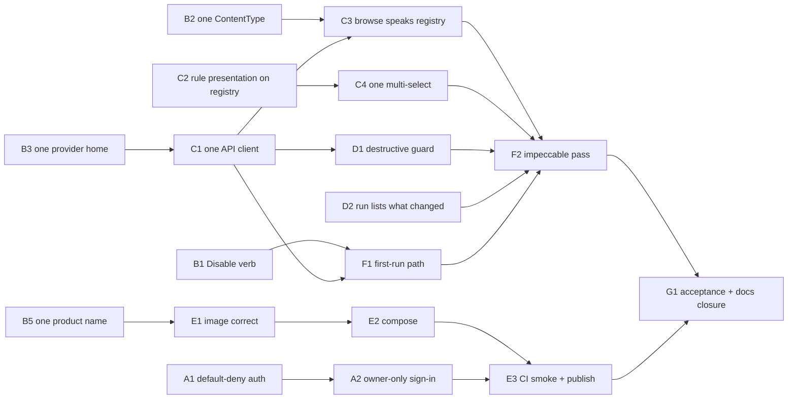

# Warden MVP path

**Status:** approved when this file merges to `main`. Execution is tracked in GitHub Issues (see
[Tracking and sign-off](#tracking-and-sign-off)). Each slice below is one PR, built test-first (`/tdd` or the
`plan-and-go:tdd-engineer` persona). It covers a different axis from the provider e2e
implementation plan (tracked in
[`provider-e2e-spec/specs/_implementation-map.md`](../provider-e2e-spec/specs/_implementation-map.md)): that plan *widens*
provider coverage, while this one *finishes the product*. Every provider phase from Tautulli (Phase
5) onward is sequenced after this MVP (see [Post-MVP](#post-mvp-parked-in-order)).

## Destination

Warden's MVP is the core loop from [`warden-core-model.md`](../../architecture/warden-core-model.md),
delivered as a container image that is safe to expose on a home network:

> A self-hoster runs `docker compose up` and signs in with Plex. The first account becomes the owner,
> and every other account is refused. They configure Radarr, Sonarr, and Plex or Tautulli, then
> build the query *"tagged `list-import`, added more than 90 days ago, unwatched"* and save it. They
> attach **Unmonitor movie** on a daily schedule and press **Run Now**. Activity then shows *which
> titles* changed. The container restarts with the schedule, history and session intact.

Every rule and task in that scenario is already built: `tagIds`, `addedDaysAgo`, `watched` and
`unmonitorMovie`. So the MVP needs very little new capability. The remaining work is **safety,
coherence and delivery**.

## Design constraints

### Primary: simplify (reuse · simplification · efficiency · altitude)

Every slice is judged against these four lenses before it is accepted:

- **Reuse.** Prefer extending an existing authority over adding a new one. A slice that adds a map,
  enum or fetcher beside an existing one is rejected.
- **Simplification.** Each slice names what it **deletes**. A heal that only adds code has not
  healed anything.
- **Efficiency.** Make no new endpoint when an existing projection can be derived from. A
  first-run state computed from existing hooks beats a `/api/setup-status` endpoint.
- **Altitude.** Fix the mechanism, not each call site. Examples: one default-deny auth mount instead
  of about 40 per-handler guards, and one registry field instead of a client lookup table per
  provider. The fracture ledger's rule applies too: *a translator is a fracture, persisted.* Heal by
  deleting the second vocabulary, never by bridging it.

### UI: impeccable (product register)

[`PRODUCT.md`](../../../PRODUCT.md) and [`DESIGN.md`](../../../DESIGN.md) are binding. Their principles
become these acceptance checks on every UI slice:

- **State clarity over polish.** Every surface has explicit loading, empty, error and success
  states. A destructive action states its blast radius (*"Deletes files for 214 movies"*) before it
  can be committed.
- **Density over decoration.** Tables and lists, not card grids. Remove the dashboard's metric
  `StatCard`s, because PRODUCT.md rejects metric-hero cards.
- **Dark-first, WCAG 2.1 AA.** Body text 4.5:1, interactive elements 3:1, visible focus rings, and a
  reduced-motion alternative for every transition.
- **Banned:** side-stripe accent borders, gradient text, decorative glass, identical card grids,
  and an eyebrow above every section. Numbered steps are allowed only where the order is real (the
  first-run checklist in F1 is a real sequence).
- **Process:** story first. Each component change starts in its `.stories.tsx` under `yarn ladle`
  with `playwright-cli`, then gets verified in context under `yarn dev` (root `CLAUDE.md`).

## Baseline (verified 2026-10-03, `main` @ `2fc775a`)

- `yarn typecheck` ✅, `yarn depcruise:ci` ✅, `yarn test:run` ✅ (166 files, 1,420 tests).
- The container image has **never been built in CI**, and Docker is not installed on the dev box.
  E1 makes the image verifiable.

## Findings this plan heals

### Blockers to exposing the container

| # | Finding | Evidence |
|---|---|---|
| X1 | **Any Plex account can sign in.** The first sign-in creates a user with no owner or allowlist check. Combined with X2, a stranger could configure providers and run delete tasks. | `server/modules/auth/authService.ts` `authenticateWithPlex` |
| X2 | **Auth is opt-in per handler, and coverage has gaps.** `/api/providers/*` (tasks, task-options, metadata, ratings) and `/api/filter-fields` have no guard. One route carries the comment *"dev/config-time endpoint — add auth when the feature moves beyond the playground stage."* | `providers.routes.ts`, `providers.handler.ts` (0 guards), `media.filterFields.*` (0 guards) |

### Vocabulary fractures (the ledger says "none open", but these are)

| # | Fracture | Evidence |
|---|---|---|
| F1 | **Automation verb model, stated three ways.** `VOCABULARY.md` says *Run Now / Disable / Archive, never Play/Pause*. The code says status `'paused'` with Pause/Play icons. `system-vs-user-automations.md` says *Pause/Resume/Delete*. Archive does not exist (it is in `docs/intent/`). | `automationService.ts:50`, `AutomationRow/index.tsx:6,165`, `automations.schemas.ts:72`, `useAutomations.ts:51,82` |
| F2 | **`ContentType` vs `MediaKind`.** Two names for `'movie' \| 'show'` (`ContentType = MediaKind`, 16 `MediaKind` sites), plus a third spelling at the HTTP boundary: `/api/media/series`, `SERIES_PARAM_TO_KEY`, `seriesSort`. | `providers/roles.ts:101`, `media/filterRegistry.ts:11`, `media.routes.ts:33` |
| F3 | **Three HTTP homes for "settings/providers."** Provider CRUD lives in a "transport-only" `settings` module at `/api/settings/providers`. Provider tasks and options live at `/api/providers`. System-wide settings live in a ninth module, `appSettings`, at `/api/app-settings`. **`appSettings` is missing from `.dependency-cruiser.cjs`'s `MODULES`, so its boundaries are unenforced.** | `server/modules/index.ts`, `settings/index.ts`, `.dependency-cruiser.cjs:14` |
| F4 | **Docs describe code that isn't there.** Core model: *"one active provider per type"* contradicts multi-instance sources. *"roles declared by the interfaces it `implements`"* contradicts the adapter-bound roles in the North Star. The `addedBy=list` example rule doesn't exist. `precedence.ts` says `primaryMediaServer` "isn't built yet", but `settingsAwarePrecedence.ts` exists, and **nothing calls `applyPrimaryMediaServer`**. The implementation map says AutomationBuilder has *"no UI for single-select"* parameters, but it does. The ledger cites `src/pages/media/mediaQueryAdapters.ts`, which is really `src/lib/`. Two intent docs link to files that don't exist (`media-actuator-realisation.md`, `plex-added-date.md`). The Dockerfile says `warden.db` while config defaults to `maintainarr.db`. The README says port 5056 while config says 5057. | as cited |

### DRY violations

| # | Duplication | Evidence |
|---|---|---|
| D1 | **13 hand-rolled SWR fetchers.** Each has its own error string, an unchecked `json.data as T` cast, and inconsistent envelopes (`/api/filter-fields` returns a bare array). Server error messages are swallowed. The shared zod schemas in `src/lib/api/schemas.ts` already exist but go unused on the client read path. | `src/hooks/use*.ts` |
| D2 | **The client re-declares rule vocabulary again.** `BOOLEAN_VALUE_LABELS`, `SEGMENT_LABEL_OVERRIDES` and `ENUM_OPTIONS`, plus the key-switched `csvIdOptions`/`csvStringOptions`. This is the same failure class Phase 4 healed (`FILTER_FIELDS`), regrowing one entry per provider. Every remaining provider phase in the e2e plan edits this file. | `MediaFilterBar/index.tsx:855-1000` |
| D3 | **The browse path still translates.** `MOVIE_PARAM_TO_KEY`/`SERIES_PARAM_TO_KEY` + `toFilterValues()`, a range "satellite map" plus a zod coverage check guarding the translator, and the client's mirror `toBrowseParams()`. Browse and save encode the same filter state two ways. | `media.handler.ts:169-345`, `src/lib/mediaQueryAdapters.ts:194` |
| D4 | **Three multi-select controls** in one 1,829-line file: `MultiSelectDropdown`, `StringMultiSelectDropdown`, and `filters/OptionFilter`. | `MediaFilterBar/index.tsx:136,342` |
| D5 | **`'active' \| 'paused'` declared in four places**, and the `z.enum(['movie','show'])` literal re-declared beside the shared `ContentTypeSchema`. | F1 sites; `mediaQueries.schemas.ts:15` |
| D6 | **Migrations copied into the image twice.** `build:server` already copies them, then the Dockerfile copies them again. `nodemon` ships in production dependencies. | `package.json` `build:server`, `Dockerfile` |

## Scope

**In the MVP:** auth safety; the five vocabulary/DRY heals; run legibility ("what changed"); a
destructive-task guard; first-run path; container image, compose file and CI smoke test; one
impeccable pass over the four MVP surfaces (Providers, Media + filters, Automations, Activity).

**Frozen, not deleted:** the Ratings page/panel and the Search page. They get no new work until
after the MVP, and the UI pass only checks they don't regress.

**Out of scope:** everything under [Post-MVP](#post-mvp-parked-in-order).

## Slice protocol

Every slice is one branch and one PR:

1. **RED.** Write the named failing test first. For a pure refactor slice, the RED step is the
   characterization or invariant test that pins today's behavior; it must pass before *and* after.
2. **GREEN.** Make the minimal change.
3. **REFACTOR + delete.** Remove everything listed under *Deletes*. A slice isn't done while its
   deletes remain.
4. **Gate.** Run `yarn verify:fast` and `yarn depcruise:ci`. UI slices also need a story,
   `playwright-cli` in Ladle, then `yarn dev`.
5. **Docs.** Use the `docs-lifecycle` triggers from root `CLAUDE.md` for every moved, renamed or
   behavior-changed file. Each heal adds a fracture-ledger entry: Open when the slice starts, Healed
   when it merges. Finish with `graphify update .`.
6. **Model.** The builder runs on the model named in the slice's **Model** line, passed as the
   agent's model override. Opus is reserved for slices that set a contract later work depends on,
   cross a security or module boundary, or need design judgement. Every PR is reviewed with
   `/code-review` on Opus, whichever model built it.

## Tracking and sign-off

- **Design:** this file. Changes to a slice's scope are edits here, made in the slice's own PR.
- **Execution:** GitHub Issues on `nokternol/warden`, in an `MVP` milestone. There is one issue
  per slice plus G1's acceptance issue, labelled `track:A`…`track:G`, `model:sonnet`/`model:opus`,
  and `blocked` until the slice's prerequisites merge. A parent tracking issue lists every slice
  as a sub-issue, with the dependency diagram below.
- **Progress:** each PR says `Closes #n`, so merging closes the slice. The milestone's completion
  percentage is the progress bar.
- **Plan sign-off:** merging the PR that adds this file. Issues are created from the merged
  version.
- **Slice sign-off:** reviewing and merging its PR. The issue's checklist must be met: RED test
  first, deletes done, gates green, docs updated, and screenshots for UI slices.
- **MVP sign-off:** ticking G1's acceptance checklist after running the Destination scenario
  against the published image on the NAS, then closing the milestone. `docs-lifecycle` then folds
  this plan's lasting content into `docs/architecture/` and deletes it.

## Slices

Tracks A, B, C2, D2 and E can start in parallel. Do Track B before the C slices that touch the same
names, so nothing is renamed twice.

### Track A — Safe to expose

**A1 · Default-deny API auth**
- **Model:** Opus 5.5 (security boundary; router-stack introspection test).
- **Why:** X2. Fixing it at the right altitude means one guard at the `/api` mount with an explicit
  public allowlist, not per-handler opt-in.
- **RED:** `server/__tests__/integration/authCoverage.integration.test.ts`. It walks the mounted
  router stack and asserts every route returns 401 when unauthenticated, except the allowlist
  (`GET /health`, `POST /auth/plex`, `POST /auth/logout`, `GET /backdrops` for the login page).
  Because it is table-free, a route added later is covered automatically.
- **GREEN:** `router.use(requireAuthUnless(PUBLIC_ROUTES))` in `server/modules/index.ts`.
- **Deletes:** every per-route and per-handler `isAuthenticated()` call (about 40 sites), and the
  "playground stage" comment.

**A2 · Owner-only sign-in** *(decision 1)*
- **Model:** Opus 5.5 (security; ownership semantics).
- **Why:** X1.
- **RED:** `authService` tests. The first Plex sign-in becomes the owner. A second, different Plex
  account gets `ForbiddenError` and no row is created. The owner signing in again still refreshes
  their token.
- **GREEN:** an owner check in `authenticateWithPlex`, either from the existing `users` row count or
  an `isOwner` column.
- **Verify:** the login page shows a clear refusal state for a non-owner. Story first.

### Track B — Heal vocabulary fractures

**B1 · Automations are Disabled, not Paused** *(decision 2)*
- **Model:** Sonnet 5.5 (mechanical schema + migration + rename).
- **Why:** F1, D5.
- **RED:** a contract test for `AutomationStatusSchema = z.enum(['active','disabled'])` in
  `src/lib/api/schemas.ts`. An `AutomationRow` test checks the control reads *Disable*/*Enable* and
  that no Play/Pause icon renders. A migration test checks existing `'paused'` rows become
  `'disabled'`.
- **GREEN:** one shared schema consumed by `automations.schemas.ts`, `automationService.ts` and
  `useAutomations.ts`, plus the migration.
- **Deletes:** the four literal unions and the `Pause`/`Play` imports.
- **Docs:** set `VOCABULARY.md`'s verb row to *Run Now / Disable / Delete* (Archive stays in
  `docs/intent/automation-archive.md`), and correct `system-vs-user-automations.md`.

**B2 · One name for movie|show**
- **Model:** Sonnet 5.5 (type rename guarded by typecheck).
- **Why:** F2, D5.
- **RED (invariant):** a mediaQueries contract test that `contentType: 'series'` is rejected and the
  schema is the shared `ContentTypeSchema`. The existing suite stays green (rename slice).
- **GREEN:** `ContentType` becomes the only TypeScript name, declared once in
  `providers/roles.ts` and re-exported by media. `SOURCE_OWNER_BY_KIND` becomes
  `SOURCE_OWNER_BY_CONTENT_TYPE`. The database column `media_identity.kind` stays as-is, since that
  is storage, not vocabulary.
- **Deletes:** `MediaKind`, the `ContentType = MediaKind` alias, and the inline `z.enum` in
  `mediaQueries.schemas.ts`.
- **Note:** the `series` route spelling is healed in C3, where the browse route is rewritten anyway.

**B3 · One home per HTTP concern**
- **Model:** Opus 5.5 (module move + dependency-direction rules).
- **Why:** F3.
- **RED:** integration tests pin provider CRUD at `/api/providers` and assert that
  `/api/settings/providers` returns 404 (the same pattern used for the retired `/api/saved-queries`).
  A depcruise **config test** asserts that every directory under `server/modules/` appears in
  `MODULES`, so a tenth module can never again ship unenforced.
- **GREEN:** move the CRUD handlers into `modules/providers/`, delete the `settings` module, rename
  `appSettings` to `settings` (`/api/settings` = system-wide settings), and add it to
  `MODULES`/`ALLOWED_TARGETS`. Wire `applyPrimaryMediaServer` into the precedence read so the
  `settings` module has its one real consumer. The alternative is deleting it; don't leave it dead.
- **Deletes:** `server/modules/settings/` (the old transport module), `appSettings` naming, and
  `/api/app-settings`.

**B4 · Doc fractures** (doc-only, via `docs-lifecycle`)
- **Model:** Sonnet 5.5 (doc corrections from a fixed list).
- Fix every F4 item. Rewrite the core model's example as `tagIds` + `addedDaysAgo` + `watched`
  (the destination scenario). Record F1–F3 and D2–D3 in the fracture ledger as Open entries,
  pointing at their slices.

**B5 · One product name** *(decision 6)*
- **Model:** Sonnet 5.5 (mechanical rename behind a guard test).
- **Why:** the repo is now `nokternol/warden`, but `maintainarr` survives as a second product name
  in user-visible and operational places. These are the log filenames (`kernel/logger.ts`), the Plex
  OAuth product and device name (`plexOAuth.ts`, shown on plex.tv's authorized devices), the default
  `DB_PATH` (`kernel/config.ts`, `drizzle.config.ts`), the Cypress home test, stories, fixtures,
  `.env.example`, `config/README.md` and the README's repo links.
- **RED:** a guard test that fails while `git grep -i maintainarr` finds anything outside an
  explicit history allowlist (migrations, `.impeccable/` critique snapshots). `config.test.ts`
  expects `./config/db/warden.db`.
- **GREEN:** rename every hit.
- **Note:** changing the Plex product name makes the instance show up as a new device on plex.tv.
  Existing sessions keep working.

### Track C — Remove duplication

**C1 · One API client**
- **Model:** Sonnet 5.5 (contract fixed by tests; hook-by-hook migration).
- **Why:** D1.
- **RED:** `src/lib/api/client.test.ts` (MSW). `apiGet(url, schema)` unwraps `{data}` and parses it
  with the shared zod schema. A non-2xx response throws `ApiError` carrying the server's `message`
  and status. A shape mismatch throws instead of returning a lie.
- **GREEN:** `src/lib/api/client.ts` with `apiGet`/`apiSend`, migrating hooks one at a time
  (green-to-green). Put `/api/filter-fields` on the `{data}` envelope.
- **Deletes:** 13 local `fetcher`s and every `json.data as T` cast.

**C2 · Rule presentation lives on the registry**
- **Model:** Opus 5.5 (registry contract every future provider builds on).
- **Why:** D2. This is the highest-leverage DRY slice, because after it a provider phase touches
  only the server.
- **RED:** a registry invariant test. Every `boolean` rule declares `valueLabels`. Every enum-shaped
  `string`/`number` rule declares `options`. Every `csv-*` rule declares a `lookup`. A
  `MediaFilterBar` test then renders a *synthetic* descriptor's labels, options and lookup with zero
  client knowledge of its key.
- **GREEN:** `MediaRule` gains `valueLabels?`, `options?`, `shortLabel?` and `lookup?`, and
  `MediaRuleDescriptor` projects them.
- **Deletes:** `BOOLEAN_VALUE_LABELS`, `SEGMENT_LABEL_OVERRIDES`, `ENUM_OPTIONS`, and the key
  switches in `csvIdOptions`/`csvStringOptions`.

**C3 · Browse speaks the registry** (after B2, C1)
- **Model:** Opus 5.5 (deletes a translator without changing results).
- **Why:** D3, and the rest of F2.
- **RED:** a parity integration test. Browsing with `FilterValueEntry[]` *E* returns exactly the ids
  that previewing a `MediaQueryRecord` saved with *E* returns. One encoding, one engine path.
- **GREEN:** browse becomes `GET /api/media/:contentType` (`movie|show`) taking the same entries as
  save.
- **Deletes:** `MOVIE_PARAM_TO_KEY`, `SERIES_PARAM_TO_KEY`, `toFilterValues()`, the range satellite
  map and its coverage check, `toBrowseParams()`, and `/api/media/movies|series`.
- **Docs:** retire or rewrite `docs/architecture/browse-range-param-enforcement.md`, since what it
  enforces is gone.

**C4 · One multi-select** (after C2; story first)
- **Model:** Sonnet 5.5 (component consolidation behind characterization tests).
- **Why:** D4.
- **RED:** `OptionMultiSelect` tests covering grouped options, instance qualification, keyboard
  navigation and clear-all. Existing `MediaFilterBar` tests act as characterization.
- **GREEN:** controls move into `src/components/filters/*`, each with a story. `MediaFilterBar`
  becomes layout plus `onRuleChange` dispatch.
- **Deletes:** `MultiSelectDropdown`, `StringMultiSelectDropdown`, and the CSV parse helpers that C3
  makes redundant.

### Track D — Finish the minimal feature set

**D1 · Destructive tasks state their blast radius** (after C1; story first)
- **Model:** Sonnet 5.5 (one component behaviour on an existing endpoint).
- **Why:** state clarity. `ActuatorTaskDescriptor.destructive` exists but the builder doesn't act on
  it.
- **RED:** an `AutomationBuilder` test. With a destructive task selected, the builder shows the live
  match count from the existing preview endpoint, as in *"Deletes files for 214 movies"*. Submit
  stays disabled until an explicit confirm control is checked. A non-destructive task never shows
  the confirm control.

**D2 · A run says what changed** *(decisions 4, 4a)*
- **Model:** Opus 5.5 (schema + identity-job behaviour + transaction).
- **Why:** PRODUCT.md's success criterion, *"no ambiguity about what ran, when, and what changed."*
  `automation_runs` stores only `itemCount` and `error`.
- **Schema:** `automation_run_items(runId → automation_runs.id ON DELETE CASCADE, mediaItemId →
  media_item.id)`. The primary key is `(runId, mediaItemId)`, which serves "what did this run
  touch". A secondary index on `mediaItemId` serves "which runs touched this item". There is no
  title or payload column; titles resolve by join at read time.
- **Pruning interaction (decision 4a):** `IdentityResolutionJob.pruneStaleItems` hard-deletes
  `media_item` rows that leave their source, which is exactly what a destructive run causes. So
  `media_item` gains a `deleted` boolean (default `false`), a soft delete within Warden's own
  database. Pruning sets the flag instead of deleting the row. Identity joins (`resolveGroup`,
  `resolveActuatorIds`, the orphan-group sweep) ignore deleted rows, and an upsert of a re-listed
  item clears the flag. There is no deletion timestamp: when a Warden run performed the delete, its
  `automation_run_items` link carries the datetime via the run's `ranAt`.
- **RED:**
  1. An executor test: a user run inserts one mapping row per matched `media_item`, and
     `itemCount` equals the mapping row count.
  2. An identity-job test: an item that leaves its source is flagged `deleted`, not removed. Its run
     history still joins to a title, it no longer resolves for actuation, and re-listing it clears
     the flag.
  3. A service test: run items for a run (paged) and runs for an item, both served from the
     indexes.
  4. An Activity page test: a run row expands to a paged list of titles, with deleted items marked
     as removed.
- **GREEN:** the migration (new table, `media_item.deleted`, index), a batched insert in
  `AutomationExecutor` inside the same transaction as the run row, the soft-deleting prune, and
  `GET /api/automations/runs/:runId/items` (paged).
- **Note:** `ActuatorTask.run(ids)` is batch-shaped and returns `void`, so a per-item outcome isn't
  knowable. The mapping records *targeted* items, and the run's status/error covers the batch.
  Per-item outcomes would need a role-contract change and are post-MVP.
- **Docs:** pruning behavior changes, so re-read `provider-roles-and-identity.md` and the
  `media_item`/Identity resolution rows in `VOCABULARY.md`.

### Track E — Containerised delivery

**E1 · The image is correct**
- **Model:** Sonnet 5.5 (container plumbing).
- **RED:** `scripts/container-smoke.sh`, run in CI because there is no Docker locally. It builds the
  image and runs it with a temporary `/app/config` volume and `SESSION_SECRET`. It polls
  `/api/health` until 200 and checks `/` serves the login page. It restarts the container and
  asserts migrations re-run idempotently with data intact. It runs `docker stop` and asserts exit in
  under 10 seconds (graceful SIGTERM).
- **GREEN:** move `nodemon`/`tsx` to devDependencies, copy `next.config.js` into the runner if
  `next({dev:false})` needs it (the smoke test decides), add `USER node`, and add a `HEALTHCHECK`
  using busybox `wget` against `/api/health`.
- **Deletes:** the duplicate migrations `COPY` (D6).
- **Depends on B5** for the `warden.db` default, so the image and its comments agree.

**E2 · Compose and run docs**
- **Model:** Sonnet 5.5 (container plumbing).
- `compose.yaml`: one service, `./config:/app/config`, `SESSION_SECRET: ${SESSION_SECRET:?}`
  (fails loudly when unset), `TZ` (cron schedules are wall-clock, so verify croner honours it with a
  scheduler test), `TRUST_PROXY`, port 5057.
- README leads with *Run with Docker*. The fnm/dev quickstart moves below it.
- The smoke script gains a compose mode, so CI tests the file users actually run.

**E3 · CI builds, smokes and publishes** *(decision 5)*
- **Model:** Sonnet 5.5 (CI wiring).
- A `container` job in `quality-gate.yml` runs the smoke test on every PR. On pushes to `main` or
  `v*` tags it publishes `ghcr.io/nokternol/warden:{sha,latest,semver}`. **Gated on A2:** no image
  is published before sign-in is owner-only.

### Track F — UI pass (impeccable)

**F1 · First-run path replaces the dashboard** *(decision 3; story first)*
- **Model:** Sonnet 5.5 (state derivation from existing hooks; story-first).
- **RED:** component tests for each setup state, derived from existing hooks with no new endpoint
  (`useProviderSettings` → `useMediaSources` → `useMediaQueries` → `useAutomations`): no providers,
  no source, no query, no automation, complete. Each incomplete state shows the one next action.
- **GREEN:** the landing route is Automations. When setup is incomplete, it leads with a three-step
  checklist (a real ordered sequence, so numbers are earned).
- **Deletes:** `pages/dashboard`, `DashboardContent`'s `StatCard` metrics, and the Dashboard nav
  item. `StatCard` goes too if nothing else uses it.

**F2 · Critique → polish the four MVP surfaces** (last UI slice)
- **Model:** Opus 5.5 (design critique judgement).
- `/impeccable critique` then `/impeccable polish` on Providers, Media + filters, Automations and
  Activity, against the constraints above: contrast, focus, reduced motion, an explicit state for
  every async boundary, and density. Run `playwright-cli` screenshots at 1440px and 400px.
- Any fix that changes behavior gets a test. Pure visual fixes are verified by screenshot.

### Track G — Acceptance

**G1 · MVP acceptance and docs closure**
- **Model:** Opus 5.5 (end-to-end acceptance and docs closure).
- Run the [Destination](#destination) scenario against the **published image** on the real NAS
  stack with `playwright-cli`. Also cover the second Plex account being refused, and System → Run Now
  for identity and enrichment before the query returns matches.
- Docs: move every fracture-ledger entry this plan opened to Healed. Update `VOCABULARY.md` and the
  core model. Re-sequence the provider e2e implementation map under Post-MVP. Then run
  `graphify update .` and `link_doc_to_code.py --apply` for touched architecture docs.

## Decisions

| # | Decision | Outcome |
|---|---|---|
| 1 | Who may sign in | **Decided: owner-only.** The first Plex sign-in claims the instance, and everyone else is refused. Plex-server-members-as-viewers is post-MVP. |
| 2 | `paused` vs `disabled` | **Decided: `disabled`**, matching `VOCABULARY.md`. |
| 3 | Dashboard | **Decided: fold into Automations** plus the first-run checklist. |
| 4 | Storage for "what changed" (D2) | **Decided: a thin mapping table**, `automation_run_items(runId, mediaItemId)` with composite PK and a `mediaItemId` index. Primary keys only, so inserts stay cheap and both directions are indexed. |
| 4a | History for items the source removed | **Decided: soft delete.** `media_item.deleted` boolean, set by `pruneStaleItems` instead of deleting the row. No timestamp column; the run link holds the datetime. Maintenance of soft-deleted rows is a separate, post-MVP concern. |
| 5 | Image registry | **Decided: GHCR** (`ghcr.io/nokternol/warden`). |
| 6 | Product and DB name | **Decided: Warden** everywhere (repo renamed to `nokternol/warden`; slice B5). The default DB file becomes `warden.db`; the existing NAS deployment renames its file once or pins `DB_PATH`. No startup fallback (that would be a translator). |

## Post-MVP (parked, in order)

1. **Source-vs-enrichment precedence.** This unblocks Plex `genres`/`certification` and Radarr
   `runtime`/`studio` (implementation-map notes).
2. Remaining parameterized tasks (`moveMovie`, `moveSeries`, `changeLanguageProfile`) and the
   `text`/`fields` parameter shapes.
3. Maintenance of soft-deleted `media_item` rows (retention or purge policy).
4. Provider e2e Phases 5–10 (Tautulli → TVMaze). After C2 these are server-only changes.
5. `docs/intent/`: automation archive, realtime run state, ratings provider, inter-provider
   dependency, editions, per-consumer watchlist.
